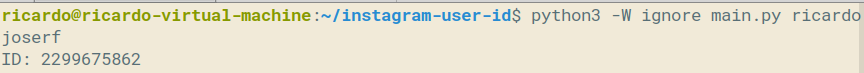
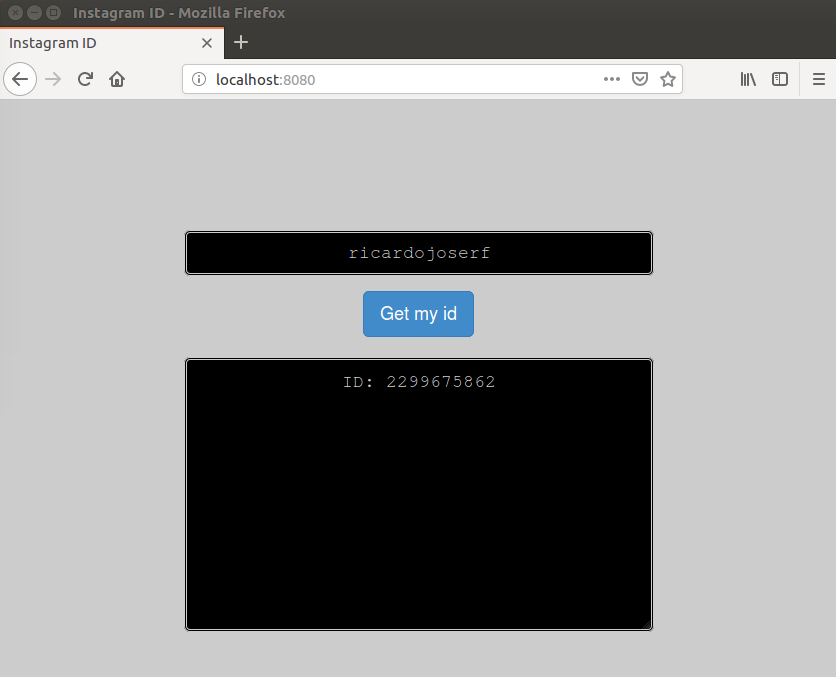

# instagram-user-id
Get the user ID of any user in instagram

## Usage

*python main.py* USERNAME

## Requirements

*pip install -r requirements.txt*

*sudo apt-get install nodejs npm*

*cd web-version && npm install && nodejs server.js*

## Example - Python script

*python main.py ricardojoserf*

## Example - Web server

